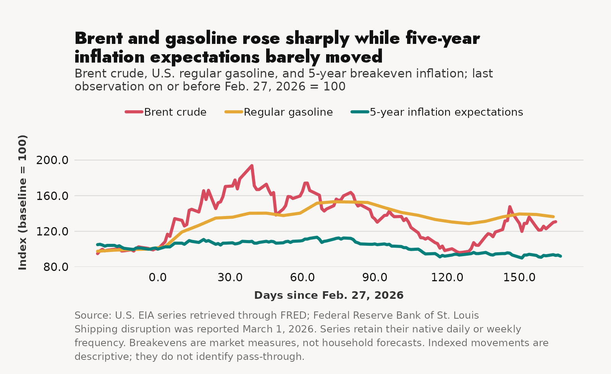

# The oil shock reached the pump. Inflation expectations stayed put.



The Strait of Hormuz carried about 20 million barrels of oil per day in 2024. EIA estimates that only 2.6 million barrels per day of spare pipeline capacity could bypass it. That is a very small detour around a very large problem.

Prices moved fast. Brent crude rose from **$71.32** on February 27 to **$93.26** on August 11, a **30.8%** increase. Regular gasoline rose from **$2.937** in the last pre-disruption weekly release to **$4.006**, up **36.4%**. Five-year breakeven inflation moved the other way, from **2.40%** to **2.21%**.

So far, this is an energy shock and a household fuel bill. It is not a break in medium-term market inflation expectations. A central bank treating every oil spike as generalized inflation would be answering a broader question than the data show.

## How the watch updates

`energy_watch` retrieves three keyless official series and EIA’s Hormuz flow workbook. Each run downloads into a unique incoming directory, hashes every artifact, validates the schemas and observation dates, and promotes a new immutable release only when all checks pass. Revisions are preserved instead of overwriting the prior record.

The estimator rebuilds the indexed paths from that promoted release. A refresh can therefore change the conclusion. If gasoline falls, breakevens rise, or an upstream source fails, the output and diagnostics say so.

## Read the files

- [Question, definitions, and limits](question.md)
- [Source-selection matrix](source-selection.md)
- [Executable estimate](estimate.py)
- [Exact chart data](data.csv)
- [Diagnostics and latest readings](diagnostics.json)
- [Chart specification](chart.yaml)
- [Interactive chart](interactive.html)

## What it cannot tell us

This is a descriptive event watch. February 27 is a useful baseline, not a causal design. Oil prices also move with global demand, production, sanctions, inventories, and expectations. Weekly gasoline can lag crude. Breakeven inflation embeds risk and liquidity premia and is not a survey of households.

The structural Hormuz figures are also not live tanker counts. They tell us why the chokepoint matters, not how many vessels crossed it today.

## Rebuild

```bash
uv run microdata sync energy_watch --year 2026
uv run python analyses/energy-2026-hormuz-inflation-watch/estimate.py
uv run microdata viz static analyses/energy-2026-hormuz-inflation-watch/data.csv analyses/energy-2026-hormuz-inflation-watch/chart.yaml analyses/energy-2026-hormuz-inflation-watch/figure.png
uv run microdata viz interactive analyses/energy-2026-hormuz-inflation-watch/data.csv analyses/energy-2026-hormuz-inflation-watch/chart.yaml analyses/energy-2026-hormuz-inflation-watch/interactive.html
```

Sources: U.S. Energy Information Administration; Federal Reserve Bank of St. Louis FRED; U.S. Treasury data used in the five-year breakeven series. Retrieved August 14, 2026.
