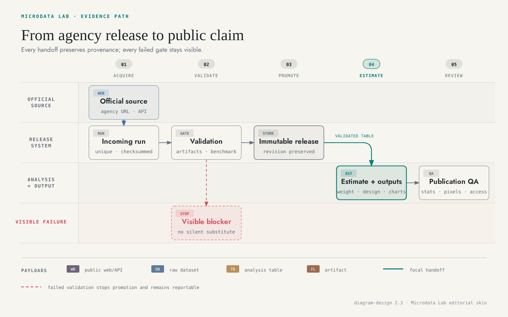
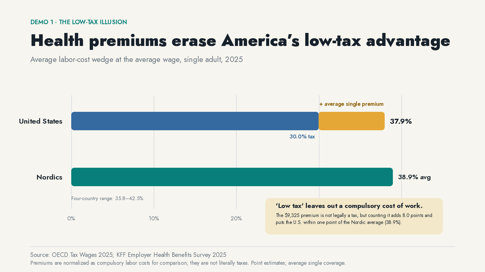
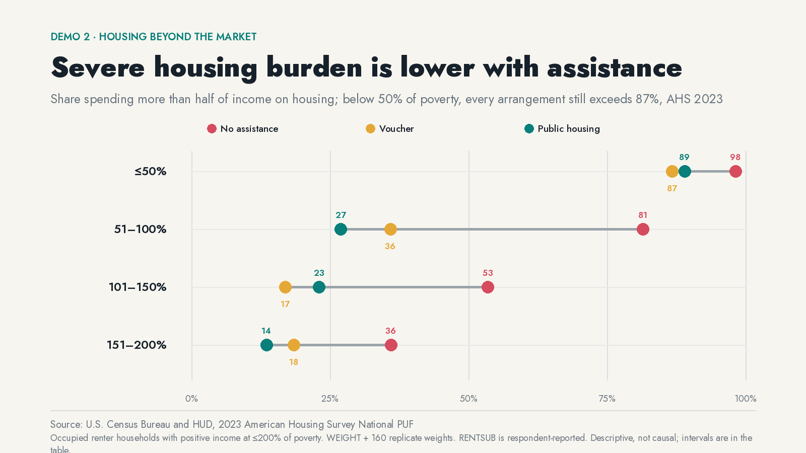
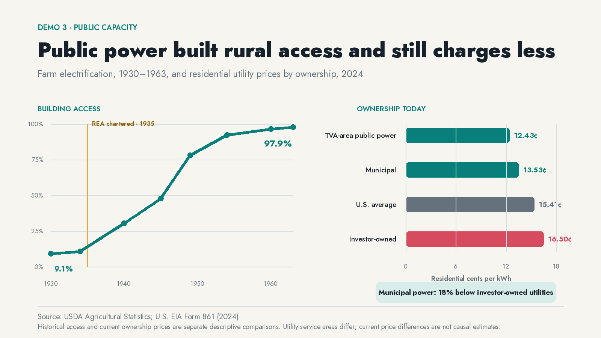

# Four arguments worth checking

Public debates are full of numbers that look settled until somebody asks what the denominator is. These demos do the annoying, useful part: define the claim, find the right release, run the design, and show where the evidence stops.

| Demo | Finding | Work shown |
|---|---|---|
| [**The low-tax illusion**](demo1-low-tax-illusion/) | Employer health premiums move the normalized U.S. labor-cost wedge from 30.0% to 37.9%—within one point of the Nordic average | Cross-source accounting with OECD and KFF definitions kept visible |
| [**Housing beyond the market**](demo2-housing-assistance/) | Public housing and vouchers coincide with lower severe burden in every low-income band studied. Below half of poverty, every arrangement fails most households | New AHS analysis with 160 replicate weights and an official benchmark |
| [**Public capacity**](demo3-public-power/) | Rural electric access rose from 9.1% to 97.9% after the public buildout; municipal utilities now charge 18% less than investor-owned utilities | Historical extraction paired with a separate current ownership comparison |
| [**The shock watch**](demo4-hormuz-watch/) | Brent and gasoline rose more than 30% after the Hormuz disruption while five-year inflation expectations fell 19 basis points | A refreshable event watch built from immutable official-source revisions |

## The same guardrail under every claim

[](../docs/diagrams/microdata-evidence-flow.html)

Every claim has to survive the same source and design checks. A failed release stays out. Descriptive evidence stays descriptive. Every published number points back to code and diagnostics.

## 1. Health premiums erase America’s low-tax advantage

[](demo1-low-tax-illusion/)

A premium routed through work is not legally a tax. It is still a compulsory labor cost for workers who need coverage. [Read the accounting and its limits.](demo1-low-tax-illusion/)

## 2. Severe housing burden is lower with assistance

[](demo2-housing-assistance/)

The private market, vouchers, and public housing split sharply until poverty gets so deep that every arrangement leaves most households severely burdened. [Read the survey design and limits.](demo2-housing-assistance/)

## 3. Public power built rural access

[](demo3-public-power/)

One panel asks who built access. The other asks what ownership looks like now. They are related, but they are not the same estimate. [Read both source trails.](demo3-public-power/)

## 4. The oil shock reached the pump—not inflation expectations

[](demo4-hormuz-watch/)

This demo refreshes. It checks whether an energy shock is still confined to energy prices or showing up in medium-term inflation expectations. [Read the latest result and run the watch.](demo4-hormuz-watch/)

## Motion has a job

All four animations keep a fixed 16:9 frame. Marks enter in reading order. Nothing crops, zooms, or changes aspect ratio, and the finished argument holds for two seconds.

- **Hidden health cost:** [GIF](demo1-low-tax-illusion/media/low-tax-illusion.gif) · [WebM](demo1-low-tax-illusion/media/low-tax-illusion.webm)
- **Housing alternatives:** [GIF](demo2-housing-assistance/media/housing-assistance.gif) · [WebM](demo2-housing-assistance/media/housing-assistance.webm)
- **Public capacity:** [GIF](demo3-public-power/media/public-power.gif) · [WebM](demo3-public-power/media/public-power.webm)
- **Hormuz shock watch:** [GIF](demo4-hormuz-watch/media/hormuz-watch.gif) · [WebM](demo4-hormuz-watch/media/hormuz-watch.webm)

## Rebuild

```bash
uv run python demos/scripts/build_media.py
```

That produces four 1600×900 PNGs and four 1280×720 GIF/WebM pairs lasting 11–13 seconds. The script checks dimensions, duration, and decodability before it exits.
