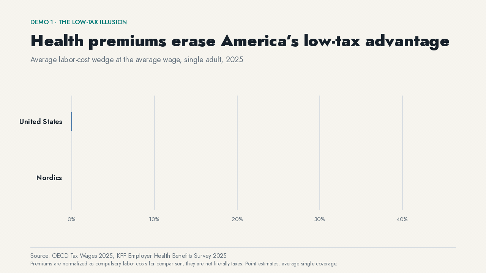

# Health premiums erase America’s low-tax advantage


A payroll tax appears on a pay stub. An employer health-insurance premium usually doesn’t. Workers still have to get coverage somewhere, and the bill still comes out of compensation.

At the average wage in 2025, the official U.S. labor tax wedge is **30.0%**. Add the average employer premium for single coverage to both labor cost and compulsory deductions and the normalized burden becomes **37.9%**—within one percentage point of the **38.9%** Nordic average.

An insurance premium is not legally a tax. Fine. “Low tax” still leaves out a large compulsory cost when one country collects through government and another routes the bill through work.

## Watch the comparison assemble



[WebM version](media/low-tax-illusion.webm)

The animation has one job: keep the official 30.0% wedge visible, add the 8.0-point premium normalization, then compare the result with the Nordic range. It does not pan, crop, or zoom.

## How the number is built

1. Validate the 2025 OECD *Taxing Wages* release and select the single-adult, no-children household type at 100% of average wages.
2. Preserve the OECD definition of labor cost and net personal average tax rate.
3. Bring in the KFF 2025 average single-coverage employer premium of **$9,325**.
4. Add that premium to both the labor-cost denominator and compulsory-cost numerator rather than simply adding percentages.
5. Compare the adjusted U.S. point with Denmark, Finland, Norway, and Sweden under the same OECD household definition.
6. Publish the unadjusted and adjusted values across 50–250% of average wages, not just the headline point.

## Audit trail

- [Question and estimand](../../analyses/oecd-tax-wedge-esi-single/question.md)
- [Executable estimate](../../analyses/oecd-tax-wedge-esi-single/estimate.py)
- [Full wage-grid data](../../analyses/oecd-tax-wedge-esi-single/data.csv)
- [Diagnostics](../../analyses/oecd-tax-wedge-esi-single/diagnostics.json)
- [Analysis methods and limits](../../analyses/oecd-tax-wedge-esi-single/README.md)

## Limits

- Premiums are normalized as compulsory labor costs for comparison; they are not literally taxes.
- The KFF premium is an average for employer-sponsored single coverage, not a marginal rate and not a value observed for every worker.
- Tax wedges do not measure the quality, universality, or distribution of benefits received.
- This is a descriptive accounting comparison, not a causal estimate of what changing the U.S. financing system would do.

## Reproduce it

The committed analysis table is enough to rebuild the media. Re-estimating from source releases requires a configured local data lake.

```bash
uv run python analyses/oecd-tax-wedge-esi-single/estimate.py
uv run python demos/scripts/build_media.py
```

Sources: OECD, *Taxing Wages 2025*; KFF, *2025 Employer Health Benefits Survey*.
