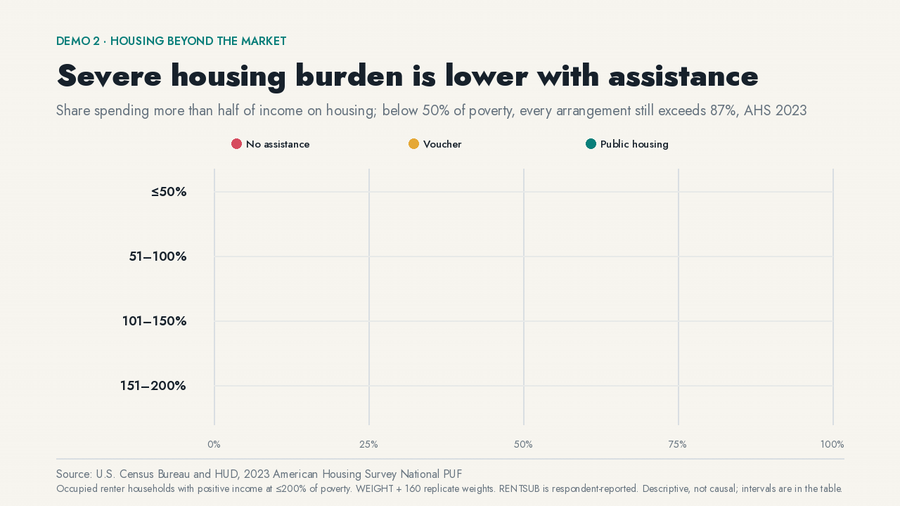

# Severe housing burden is lower with assistance


Housing politics usually gets flattened into a fight over supply and rent control. The household data let us ask a different question: what changes when low-income renters live in public housing, use a voucher, or get no assistance at all?

In the 2023 American Housing Survey, severe housing-cost burden is lower with assistance in every income band studied. Among households at **51–100% of poverty**, **81%** of renters without assistance spend more than half their income on housing, compared with **36%** of voucher users and **27%** of public-housing residents. At **101–150%**, the corresponding estimates are **53%**, **17%**, and **23%**.

The bottom band is the warning label. Below half the poverty threshold, severe burden exceeds **87%** under every arrangement. Assistance matters, but income this low still overwhelms it.

## Watch the alternatives enter the comparison



[WebM version](media/housing-assistance.webm)

The animation first shows the private-market baseline, then vouchers, then public housing. Connectors only join alternatives already on screen; the frame never moves.

## What the data adds

The debate starts from very different diagnoses. A [Jacobin essay on homeownership and landlord power](https://jacobin.com/2026/08/homeownership-inequality-rent-landlords-capitalism) centers ownership. A [Cato argument against rent control](https://www.cato.org/commentary/rent-control-would-hurt-people-it-intends-help) centers supply and allocation. Neither tells us how burden differs across assistance arrangements.

The AHS can. It gives us a defined universe, an official assistance variable, a household burden measure, and uncertainty from the survey’s actual replicate design.

## How the estimate is built

1. Select AHS rather than ACS or SIPP because AHS directly records respondent-reported public housing, vouchers, total monthly housing cost, poverty level, and the full replicate design in one household file.
2. Read the codebook instead of inferring meaning from `RENTSUB`, `TOTHCAMT`, or `PERPOVLVL`.
3. Restrict the universe to occupied renter households with positive income at 2–200% of the poverty threshold.
4. Define severe burden as annualized total monthly housing cost greater than 50% of annual household income.
5. Apply `WEIGHT` and all **160** AHS replicate weights with the official variance factor.
6. Reproduce the official national occupied-housing benchmark before accepting the analysis.

## Audit trail

- [Source-selection note](../../analyses/ahs-2023-severe-rent-burden-by-assistance/source-selection.md)
- [Question and estimand](../../analyses/ahs-2023-severe-rent-burden-by-assistance/question.md)
- [Executable estimate](../../analyses/ahs-2023-severe-rent-burden-by-assistance/estimate.py)
- [Public/no-assistance chart data](../../analyses/ahs-2023-severe-rent-burden-by-assistance/data.csv)
- [All three assistance groups](../../analyses/ahs-2023-severe-rent-burden-by-assistance/all-groups.csv)
- [Diagnostics, intervals, and benchmark](../../analyses/ahs-2023-severe-rent-burden-by-assistance/diagnostics.json)
- [Static analysis chart](../../analyses/ahs-2023-severe-rent-burden-by-assistance/figure.png) · [interactive chart](../../analyses/ahs-2023-severe-rent-burden-by-assistance/interactive.html)

## Do not read this as a treatment effect

Public housing and voucher use are not randomly assigned. Households differ in income, location, eligibility, household composition, waiting-list access, and unobserved need. The chart is descriptive and stratified by poverty band; it is not a causal estimate of treatment effects.

`RENTSUB` is respondent-reported. The analysis excludes nonpositive income and out-of-universe or invalid housing-cost records. Confidence intervals are retained in the machine-readable table and diagnostics but are not drawn as whiskers.

## Reproduce it

```bash
uv run python analyses/ahs-2023-severe-rent-burden-by-assistance/estimate.py
uv run microdata check-analysis
uv run python demos/scripts/build_media.py
```

Source: U.S. Census Bureau and HUD, 2023 American Housing Survey National Public Use File.
