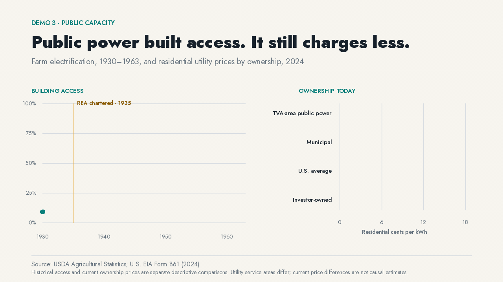

# Public power built rural access and still charges less


In 1930, only **9.1%** of U.S. farms had central-station electric service. The Rural Electrification Administration was chartered in 1935. By 1963, service reached **97.9%**.

That buildout set the baseline for today’s ownership debate. In 2024, municipal utilities charged **13.53¢ per kWh** on average. Investor-owned utilities charged **16.50¢**, a descriptive gap of **18%**. Public-power utilities in the Tennessee Valley area averaged **12.43¢**.

Public financing extended service where private utilities had little reason to wire scattered farms. Public ownership did not disappear after the job was done. People still get power from municipal utilities, and they pay less on average.

## Watch the institution appear in the data



[WebM version](media/public-power.webm)

The animation draws the historical series after the 1935 institutional marker, holds the completed access story, then grows the current ownership bars from a zero baseline. It never turns a static chart into a camera move.

## How the comparison is built

1. Preserve the historical series and its definitions from USDA agricultural statistics rather than interpolating missing years.
2. Place the 1935 REA marker on the same time scale without claiming that a five-point series alone identifies a causal effect.
3. Calculate 2024 residential cents per kWh from EIA Form 861 sales and revenue rather than averaging utility-level rates.
4. Keep municipal, cooperative, investor-owned, and TVA-area public-power categories distinct.
5. Separate the historical access panel from the present ownership comparison so two different estimands do not masquerade as one regression.

## Audit trail

### Historical access

- [Question and estimand](../../analyses/rea-1930-1960-rural-electrification/question.md)
- [Data](../../analyses/rea-1930-1960-rural-electrification/data.csv)
- [Diagnostics](../../analyses/rea-1930-1960-rural-electrification/diagnostics.json)
- [Methods and limits](../../analyses/rea-1930-1960-rural-electrification/README.md)

### Ownership today

- [Question and estimand](../../analyses/public-vs-iou-power-cost/question.md)
- [Data](../../analyses/public-vs-iou-power-cost/data.csv)
- [Diagnostics](../../analyses/public-vs-iou-power-cost/diagnostics.json)
- [Methods and limits](../../analyses/public-vs-iou-power-cost/README.md)

## Two comparisons, neither causal

The historical chart is not a causal event study. The current comparison is not a causal ownership effect: public and private utilities serve different territories, generation mixes, customer densities, and regulatory environments. The figure reports point estimates; it does not draw uncertainty whiskers that the underlying tabulations do not support.

## Reproduce it

```bash
uv run python analyses/rea-1930-1960-rural-electrification/estimate.py
uv run python analyses/public-vs-iou-power-cost/estimate.py
uv run python demos/scripts/build_media.py
```

Sources: USDA, *Agricultural Statistics*; U.S. Energy Information Administration, Form 861 (2024).
