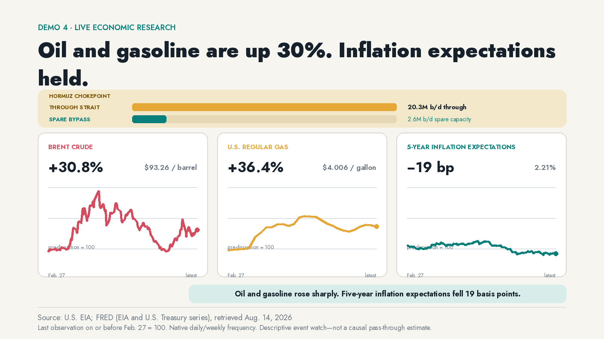
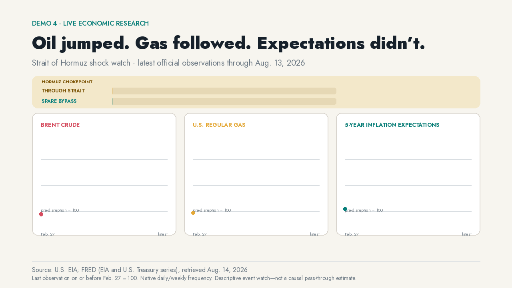

# Oil and gasoline are up more than 30 percent. Five-year inflation expectations are down 19 basis points.



About **20 million barrels of oil per day** crossed the Strait of Hormuz in 2024. EIA estimates that only **2.6 million barrels per day** of spare pipeline capacity could bypass it. That is a very small detour around a very large problem. The 2026 disruption lets us watch the price path as new releases arrive.

Since the last pre-disruption observation, Brent crude is up **30.8%** and U.S. regular gasoline is up **36.4%**. Five-year breakeven inflation is down **19 basis points**. The shock is obvious in energy markets and at the pump. It has not, so far, broken medium-term market inflation expectations.

This is where policy can go wrong. An oil spike can make people poorer without becoming a generalized wage-price spiral. Fighting it with broad demand destruction would impose another cost on households already paying more for fuel.

## Watch the evidence arrive



[WebM version](media/hormuz-watch.webm)

The frame stays put. The animation adds the chokepoint exposure, then the crude-price shock, then the price at the pump, then the inflation-expectations check. It does not zoom a completed chart around the screen.

## This one keeps researching

The other demos rebuild from fixed public releases. This one asks whether the conclusion survives the next daily or weekly observation.

```bash
uv run python demos/demo4-hormuz-watch/refresh.py
```

A refresh:

1. retrieves Brent, gasoline, and breakeven inflation through the `energy_watch` source adapter;
2. downloads EIA’s published Hormuz flow workbook;
3. hashes and validates every artifact before promotion;
4. preserves upstream revisions instead of overwriting them;
5. rebuilds the estimate, diagnostics, charts, and demo media only when the release changes.

No scheduler is installed by the repository. Run the command manually or attach it to whatever job runner you already trust.

## Read the work

- [Question and estimand](../../analyses/energy-2026-hormuz-inflation-watch/question.md)
- [Source-selection matrix](../../analyses/energy-2026-hormuz-inflation-watch/source-selection.md)
- [Executable estimate](../../analyses/energy-2026-hormuz-inflation-watch/estimate.py)
- [Chart data](../../analyses/energy-2026-hormuz-inflation-watch/data.csv)
- [Diagnostics and latest readings](../../analyses/energy-2026-hormuz-inflation-watch/diagnostics.json)
- [Static chart](../../analyses/energy-2026-hormuz-inflation-watch/figure.png) · [interactive chart](../../analyses/energy-2026-hormuz-inflation-watch/interactive.html)

## Limits

The event date is an organizing baseline, not a causal design. Oil, gasoline, and breakevens respond to more than the conflict. The gasoline series is weekly. Breakeven inflation includes risk and liquidity premia. EIA’s 20 million-barrel figure is a structural baseline, not a live vessel count.

Sources: U.S. Energy Information Administration; Federal Reserve Bank of St. Louis FRED; U.S. Treasury. Retrieved August 14, 2026.
